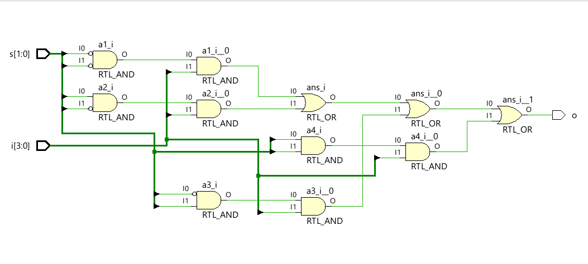
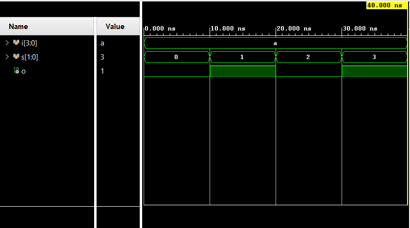

# 4x1 Multiplexer using Verilog HDL

## Description
This project implements a 4x1 Multiplexer using Gate-Level Modeling in Verilog HDL. The design is verified using a testbench in Xilinx Vivado.

## Tools Used
- Verilog HDL
- Xilinx Vivado

## Files
- `fourXone_MUX.v` – Verilog design file
- `fourXone_MUX_tb.v` – Testbench

## Truth Table

| Select (S1 S0) | Output |
|----------------|--------|
| 00             | I0     |
| 01             | I1     |
| 10             | I2     |
| 11             | I3     |

## RTL Schematic

## Simulation Waveform

## Author

Aaditya Patil
